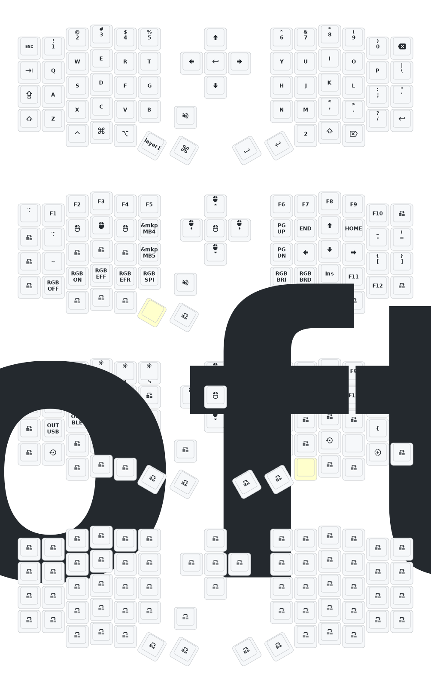

# Update List

- 2024/12/21
  1. Added support for zmk-studio (just refresh the left hand to use).
- 2024/10/24
  1. Modified power supply mode to reduce power consumption.
  2. Fixed the automatic shut-off feature for RGB power supply.

> If your keyboard was updated before October 24, please update to the latest firmware.

Flashing Your Sofle Keyboard with ZMK Firmware
This guide will walk you through the process of flashing your Sofle keyboard with custom ZMK firmware.
Prerequisites

A Sofle keyboard with Nice!Nano controllers
USB Type-C cable
Computer with internet access

Steps to Flash Firmware
1. Prepare the Firmware

Fork this repository to your GitHub account (name it whatever you like)
Navigate to the Actions tab in your forked repository
On the sidebar, click on Build ZMK Firmware
Click on Run workflow and select the "main" branch
Wait for the action job to complete
Click on the completed Build ZMK Firmware job
Under Artifacts, click on "firmware" to download the ZIP file
Save and extract the downloaded firmware ZIP file

2. Flash the Left Half

Connect the left half of your Sofle keyboard to your computer using a USB Type-C cable
Press the reset button twice on the controller to enter bootloader mode

The keyboard should now mount as a USB drive named NICENANO

Open a terminal window and navigate to the firmware folder:
bashCopycd path/to/firmware

Flash the left half firmware:
bashCopymv nice_view-eyelash_sofle_left-zmk.uf2 /Volumes/NICENANO/CURRENT.UF2

You may see the following error message:
bashCopymv: fastcopy: write() failed: /Volumes/NICENANO/CURRENT.UF2: Input/output error
Note: This error can be safely ignored. It appears because the controller automatically disconnects and reboots once the firmware is successfully flashed.

3. Flash the Right Half

Disconnect the left half and connect the right half of your Sofle keyboard
Press the reset button twice on the controller to enter bootloader mode
Flash the right half firmware:
bashCopymv nice_view_custom-eyelash_sofle_right-zmk.uf2 /Volumes/NICENANO/CURRENT.UF2

You'll see the same error message as before, which can be ignored

Enjoy your newly flashed Sofle Keyboard. 
---
# My Customized Sofle Keyboard Keymap & Layout

